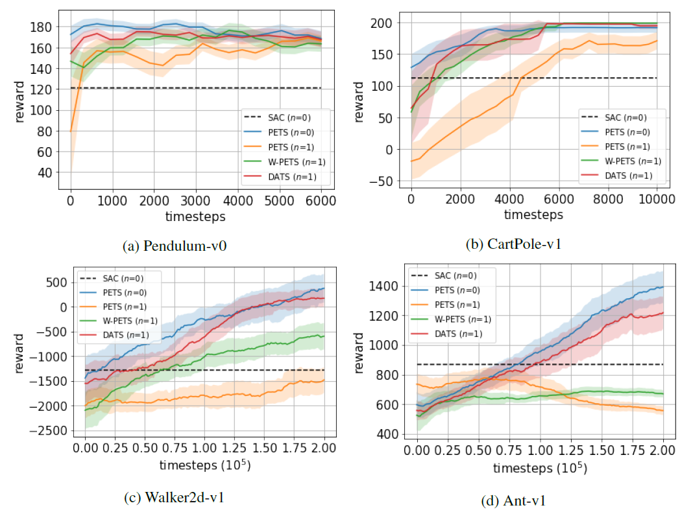

# Delay-Aware Model-Based Reinforcement Learning
<p align=center>

</p>

**Abstract** Action delay prevalently exists in real world systems and is one of the key reasons leading to degraded performance of reinforcement learning. In this paper, we introduce a formal definition of delayed Markov Decision Process and prove it can be transformed into standard MDP with augmented states using Markov reward process. We then develop a delay-aware model-based reinforcement learning framework to directly incorporate the multi-step delay into the learned system models without learning effort. Experiments are conducted on the Gym and MuJoCo platforms. Results show that compared with off-policy model-free reinforcement learning methods, the proposed delay-aware model-based algorithm is more efficient in training and transferable between systems with variant durations of delay.

## Installation
This code-base is based on [PETS](https://github.com/kchua/handful-of-trials).
run ```pip install -r requirements.txt.``` to install the python dependency.
The current environments are simulated with MuJoCo 1.31. Please follow the installation procedures of MuJoCo + OpenAI gym, if the default pip installation fails.

# Run the code!
Below is an example to reproduce the results.

## DATS for pendulum with action delay
```
python mbexp.py -logdir ./log/DATS \
    -env gym_pendulum \
    -o exp_cfg.exp_cfg.ntrain_iters 200 \
    -o exp_cfg.sim_cfg.delay_hor 10\
    -o ctrl_cfg.prop_cfg.delay_step 10\
    -ca opt-type CEM \
    -ca model-type PE \
    -ca prop-type E
```

## Changing Hyper-parameters

This repo is based on the PETS repo. And therefore we use the same hyper-parameters / arguments system.

### Environment Arguments

The benchmark environment is based on [MBBL](https://github.com/WilsonWangTHU/mbbl).
```
python scripts/mbexp.py
    -env    (required) The name of the environment. Select from
            [reacher, pusher, halfcheetah, gym_ant, gym_cartpole, gym_fswimmer, ...].
```
Please look at ```./dmbrl/config``` for more environments.

### Control Arguments

All the old arguments are kept the same as they were in [PETS](https://github.com/kchua/handful-of-trials).
We refer the original code repo for the old arguments.

To set action delay step, follow the below example scripts for DATS-pendulum:
```
python mbexp.py -logdir ./log/DATS \
    -env gym_pendulum \
    -o exp_cfg.exp_cfg.ntrain_iters 200 \
    -o exp_cfg.sim_cfg.delay_hor 10\
    -o ctrl_cfg.prop_cfg.delay_step 10\
    -ca opt-type CEM \
    -ca model-type PE \
    -ca prop-type E
```

# Results Logger

Results will be saved in `<logdir>/<date+time of experiment start>/logs.mat`.
The logging file generated during the training can be observed in ```<logdir>/*/*.log/logger.log```.
